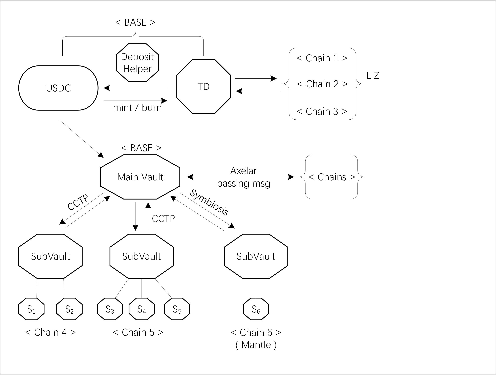

# Characteristics

* Yield-generating stablecoin fully collateralised with yield-generating DeFi assets, with TD (Tizi Dollar) pegged to USDC in a 1:1 ratio.
* A DeFi equivalent of a money market fund, boasting a highly conservative and liquid portfolio with profits distributed daily.
* Simple to use: just mint and forget, and your money will grow.

<figure><figcaption>
Legend: hexagon—contracts, {} – set of chains, Arrow—How the money flows, &#x3C;> -- chain
</figcaption></figure>
