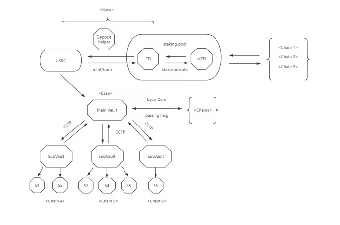

# Characteristics

* TD is the user entry token, always minted at a soft peg of 1:1 to USDC (with a 0.04% fee upon redemption).
* stTD is the staking token, obtained by staking TD. It is a hybrid token that automatically generates yield through a delta-neutral strategy. It represents a claim on the underlying TD and accumulated yields. By unstaking, you receive new TD based on the prevailing stTD/TD ratio, capturing the growth in TD.
* DeFi Money Market Fund — this is a money market fund in the DeFi space, offering a conservative yet liquid portfolio. The fund distributes profits daily, providing investors with a stable and continuous source of yield.
* Simple to use: simply mint (TD) and stake directly (to receive stTD) once, then sit back and relax — your funds will grow automatically.

<figure><figcaption></figcaption></figure>
